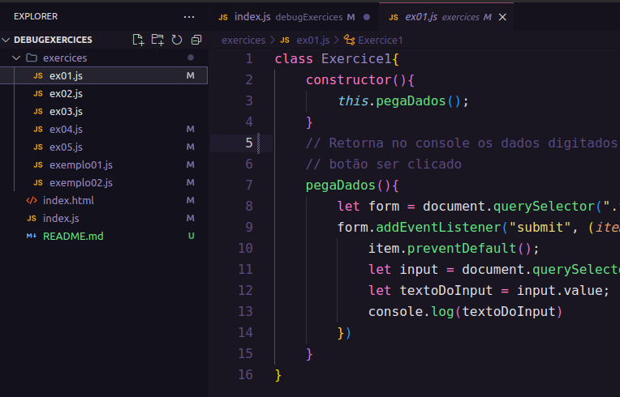
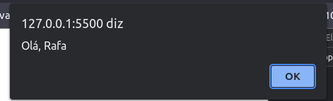

<h1>Exercícios de debug</h1>

Uma das habilidades mais utilizadas no dia a dia de um desenvolvedor é a de resolver falhas(bugs). Desta forma, é mais do que necessário treinarmos desde o início da formação profissional a leitura de erros e a busca por soluções. Porque o que faz um bom desenvolvedor não é apenas o bom código escrito, mas a capacidade de pesquisa e autodidatismo necessária para transpor obstáculos em qualquer projeto.  E esta pequena lista de exercícios pretende dar início a construção dessas habilidades, por meio da resolução de cinco bugs simples; hora expressos em erros no console, hora expressos em funções que apresentam comportamentos diferentes do esperado. 

<h3>Como fazer os exercícios.</h3>
<ol>
  <li>Descomente a linha que instância a classe do exercícios no arquivo index.js
</li>
  
  <li>Clique na pasta “exercices”
</li>
  
  <li>Abra o index.html no navegador para poder analisar os erros. 
</li>
</ol>
<h3>Exemplos</h3>
<h5>Exemplo1</h5>

Esta função, quando escrita com a sintaxe correta, retorna a mensagem ‘Olá’ no console. Porém, em vez disso, temos um erro. Nesta mensagem podemos ler que o bug está na linha 7 do arquivo exemplo01.js, e que ‘console.lg is not a function’. Portanto, podemos inferir que: 

  
<ol type="I">
  <li>console.lg não é uma função porque não foi declarada. 
</li>
  <li>console.lg não é uma função porque não instanciada corretamente 
</li>
  <li>console.lg não é uma função porque houve um erro de digitação no uso de um método nativo.  
</li>
</ol>

Após uma curta análise é possível concluir que a alternativa 3 descreve o que ocorreu e assim pesquisar a sintaxe correta para a solução da falha.

<code>console.log()</code>
  
<h5>Exemplo2</h5>

Aqui temos um erro de sintaxe muito parecido com o do exemplo anterior. Há no console a mensagem ‘window,prompty is not a function’ indicando que o comando no arquivo exemplo02.js, na linha 7 não está funcionando. E a solução passa pelas mesmas etapas que vimos anteriormente, sendo a solução a pesquisa da sintaxe correta do window.prompt.

  
  
  
<h2>Descrição dos exercícios </h2>
<h3>1) pegaDados()</h3>

A função pegaDados, quando escrita corretamente, captura os dados digitados pelo usuário no input e retorna-os no console. 

<h5>Comportamento correto</h5>

<h5>Error</h5>

<h3>2) salvaDados()</h3>

A função salvaDados, quando escrita corretamente, captura os dados digitados pelo usuário no input e os salva no localStorage. 
Comportamento correto

<h5>Comportamento correto</h5>

<h5>Error</h5>

<h3>3) mostraDados()</h3>

A função mostraDados, quando escrita corretamente, captura os dados digitados pelo usuário no input e retorna-os em um h1 abaixo do input.

<h5>Comportamento correto</h5>

<h5>Error</h5>

<h3>4) calc()</h3>

A função calc, quando escrita corretamente, captura expressões matemáticas digitadas no input e retorna o resultado no console.

<h5>Comportamento correto</h5>

<h5>Error</h5>

<h3>5) soma()</h3>

A função soma, quando escrita corretamente, captura dois números digitados pelo usuário no prompt e retorna o resultado em um alert.

<h5>Comportamento correto</h5>

<h5>Error</h5>

<h1>Bons estudos!</h1>
